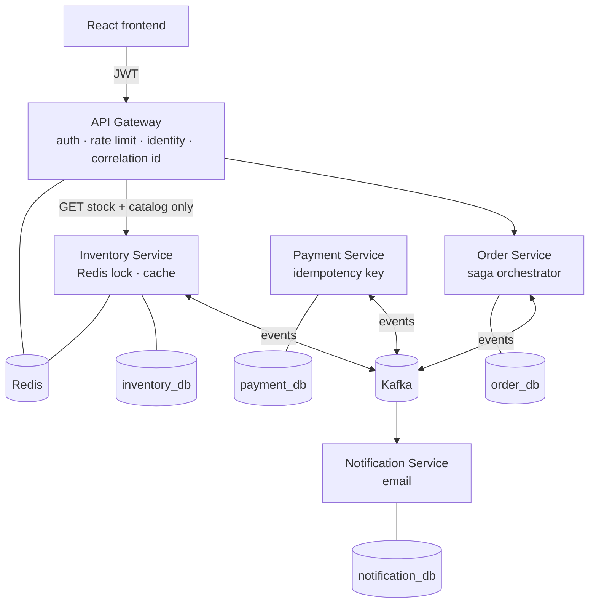
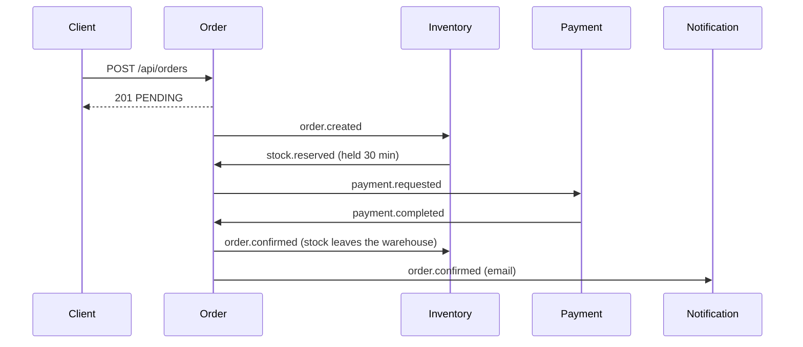
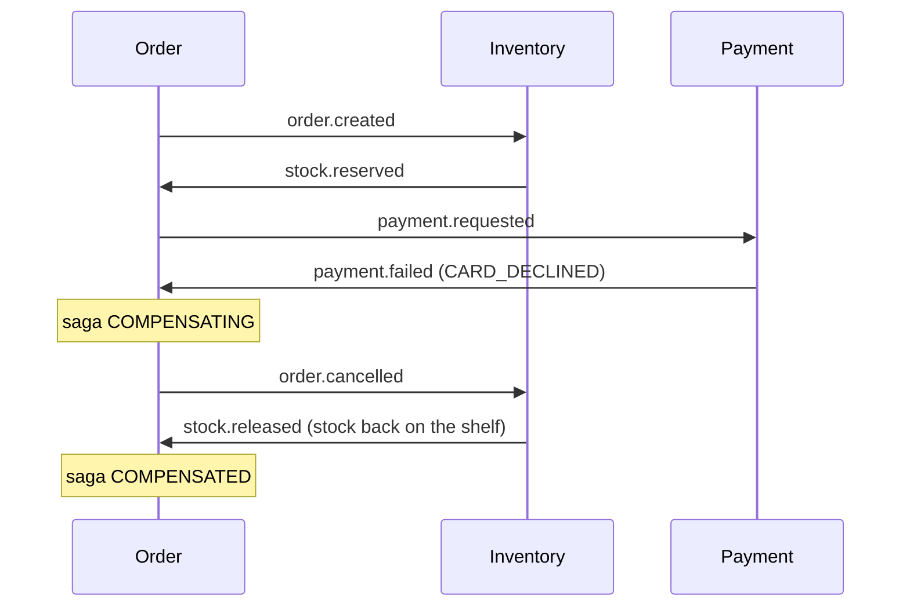
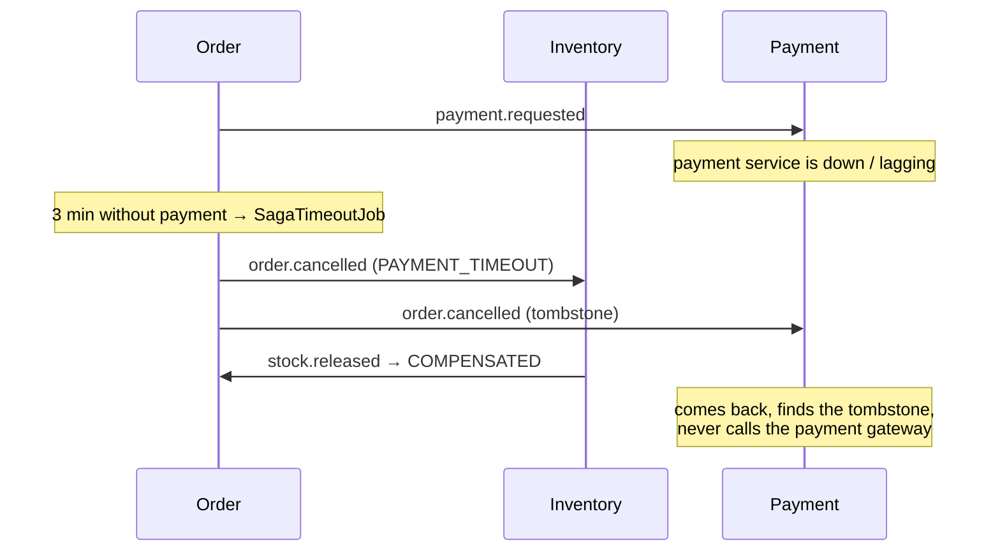

# OrderFlow

[](https://github.com/Nhatht/orderflow/actions/workflows/ci.yml)

> Event-driven order processing platform built with Java 21, Spring Boot 3 and Apache Kafka.

Distributed order processing across four services, coordinated by a Saga orchestrator with compensating transactions. Built to explore the hard parts of distributed systems — reliable event delivery, idempotency, concurrency control, timeouts and tracing — rather than to maximise feature count.

> **Try it in one command:** `docker compose up --build`, then open http://localhost:3000 ([details](#getting-started)).

---

## Architecture



- **Each service owns its database.** No cross-service joins, no shared schema.
- **Services talk to each other only through Kafka.** The gateway is the single entry point from the outside, not a path between services.
- **The payment service is not reachable from outside** — it stores no owner, so it cannot check who may read a payment.

## Key patterns

| Pattern | Problem it solves | Where |
|---|---|---|
| **Saga (orchestration)** | No distributed transaction across three databases | `OrderSagaOrchestrator` |
| **Transactional Outbox** | DB commit succeeds but Kafka publish fails → lost event | `OutboxEventPublisher` + `OutboxPoller` in each service |
| **Idempotent consumer** | Kafka is at-least-once → duplicate delivery | `processed_events`, payment `UNIQUE(order_id)`, notification ledger |
| **Redis distributed lock** | Overselling under concurrent checkout | `RedissonLockAdapter`, `ReserveOrderStockService` |
| **Dead letter topic + retry** | A poison message blocking a partition | `KafkaConfig` in each service |
| **Cache-aside + event invalidation** | Stale stock shown to customers | `GetStockService`, `StockChangedListener` |
| **Distributed tracing** | Following one request across five services — through the outbox | `OutboxTracing`, Jaeger |
| **Testcontainers** | Integration tests against real Kafka / Postgres / Redis / SMTP | `*IT.java` |

Each is documented at the point of use — read the Javadoc at the top of the class.

## The saga

### Happy path



### Card declined → compensation



### No payment within 3 minutes → saga timeout



The saga owns the only clock that matters (3 min). Stock reservations expire after 30 min — a safety net for orphaned orders, deliberately much longer so the two clocks never race.

## Getting started

### Run everything with one command

Requires only Docker (Docker Desktop, or Docker Engine with Compose v2.20+).

```bash
git clone https://github.com/Nhatht/orderflow.git && cd orderflow
docker compose up --build        # first run: a few minutes to download images and build
```

Open **http://localhost:3000** and sign in as `alice` / `alice123`. This starts the infrastructure, the five services and
the frontend (15 containers); stop with `docker compose down` (add `-v` to wipe the data).

Check that the whole system works end to end (places a real order that completes and one that is compensated;
needs nothing installed on the host):

```bash
docker run --rm --network orderflow_default -v "$PWD/scripts:/scripts:ro" alpine:3.20 \
  sh -c "apk add -q bash curl jq && BASE_URL=http://api-gateway:8080 bash /scripts/smoke-test.sh"
```

Prebuilt images are published to GitHub Container Registry on every green build of `main`, so you can skip the build:

```bash
export ORDERFLOW_REGISTRY=ghcr.io/nhatht/orderflow ORDERFLOW_TAG=latest
docker compose pull && docker compose up --no-build
```

### CI/CD

[`.github/workflows/ci.yml`](.github/workflows/ci.yml) runs on every push and pull request:

| Job | What it proves |
|---|---|
| `backend` | `mvn verify`: every unit and integration test, against real Kafka / PostgreSQL / Redis via Testcontainers |
| `frontend` | TypeScript typecheck and production build |
| `e2e` | `docker compose up` of the whole system, then [`scripts/smoke-test.sh`](scripts/smoke-test.sh) places real orders through the gateway and through the frontend's nginx |
| `publish` | only on `main` after the three above pass: pushes the six images to `ghcr.io` |

### Development setup

For working on the code: infrastructure in Docker, services from the IDE or `java -jar`, frontend with Vite.
Requires JDK 21, Maven 3.9+, Node 22, Docker. Stop the Docker stack above first: both use ports 8080-8083.

```bash
# 1. Infrastructure: Kafka, Redis, PostgreSQL ×4, Jaeger, MailHog, Kafka UI
docker compose -f infra/docker/docker-compose.yml up -d

# 2. Build (runs every unit + integration test; needs Docker for Testcontainers)
cd backend && mvn clean verify

# 3. Run each service in its own terminal (or from the IDE)
java -jar services/order-service/target/order-service-0.0.1-SNAPSHOT.jar
java -jar services/inventory-service/target/inventory-service-0.0.1-SNAPSHOT.jar
java -jar services/payment-service/target/payment-service-0.0.1-SNAPSHOT.jar
java -jar services/notification-service/target/notification-service-0.0.1-SNAPSHOT.jar
java -jar services/api-gateway/target/api-gateway-0.0.1-SNAPSHOT.jar
```

### Try it

```bash
# Log in (demo users: alice/alice123, bob/bob123)
TOKEN=$(curl -s -X POST localhost:8080/auth/login -H 'Content-Type: application/json' \
  -d '{"username":"alice","password":"alice123"}' | sed -E 's/.*"accessToken":"([^"]+)".*/\1/')

# Place an order (a total ending in 99 is declined by the simulated gateway → compensation)
curl -X POST localhost:8080/api/orders -H "Authorization: Bearer $TOKEN" -H 'Content-Type: application/json' \
  -d '{"currency":"VND","items":[{"productId":"11111111-1111-1111-1111-111111111111","productName":"Coconut candy","quantity":2,"unitPrice":45000}]}'

# Watch the saga step by step
curl localhost:8080/api/orders/<orderId>/saga -H "Authorization: Bearer $TOKEN"
```

| Service | URL |
|---|---|
| Frontend | http://localhost:3000 (Docker) · http://localhost:5173 (`npm run dev`) |
| API Gateway | http://localhost:8080 |
| Jaeger (traces) | http://localhost:16686 |
| MailHog (emails) | http://localhost:8025 |
| Kafka UI | http://localhost:8090 |
| Swagger UI (direct, not via gateway) | http://localhost:8081/swagger-ui.html · :8082 · :8083 |

Every log line carries `[service,traceId,spanId,correlationId]` — paste the `traceId` into Jaeger to see the whole request: one order produces a single trace of ~57 spans across all five services, including the outbox relays.

## Frontend

React 18 + TypeScript + Vite, TanStack Query (server state), Zustand (client state), Tailwind CSS.
Pages: sign in, catalog, cart and checkout, order list, and **order detail with a live saga timeline**.

```bash
# backend running as above (gateway on :8080)
cd frontend
npm install
npm run dev          # http://localhost:5173, proxies /api and /auth to the gateway (no CORS needed in dev)
npm run typecheck
```

After checkout the app opens the new order and follows its saga while it runs. The page polls
`GET /api/orders/{id}/saga` once a second and stops as soon as the saga reaches a final state
(`COMPLETED`, `COMPENSATED` or `FAILED`).

To see compensation from the UI, add **Trà atiso Đà Lạt** (30.099 ₫) to the cart: every total whose integer part
ends in 99 is declined by the simulated payment gateway, so the stock already reserved is released again.

### Reading the saga timeline

The UI is in Vietnamese. The words that matter:

| On screen | Meaning | Saga step / status |
|---|---|---|
| Giữ hàng | Reserve stock | `RESERVE_STOCK` (inventory-service) |
| Thu tiền | Charge the card | `PROCESS_PAYMENT` (payment-service) |
| Xác nhận đơn | Confirm the order | `CONFIRM_ORDER` (order-service) |
| Nhả hàng về kho · Đền bù | Release stock, a compensating step | `RELEASE_STOCK` (inventory-service) |
| Hoàn tất / Đã đền bù / Thất bại | Completed / Compensated / Failed | saga status |
| Đã xác nhận / Đã huỷ | Confirmed / Cancelled | order status |
| Gửi lệnh … phản hồi sau … ms | Command sent at … , reply received … ms later | one Kafka round trip |

**Card declined, saga `COMPENSATED`.** The order page shows this timeline (text copy of one real run):

```text
Order #2e479a3f   Đã huỷ (cancelled)                         30.099 ₫
Saga  Đã đền bù (compensated)                        finished after 1,54 s
Reason: CARD_DECLINED

 +2 ms    ✓ Giữ hàng        inventory-service   succeeded      reply after 525 ms
 +527 ms  ✗ Thu tiền        payment-service     card declined  reply after 666 ms
 +1,19 s  ↺ Nhả hàng về kho inventory-service   Đền bù         reply after 348 ms
```

- **Total** comes from the server (`BigDecimal`); the browser never adds money up.
- **Left column**: time since the saga started. Steps are not simultaneous; each one waits for the previous reply to
  come back over Kafka (command → outbox → Kafka → other service → outbox → Kafka → orchestrator).
- **Reply after … ms**: how long the other service took to answer that command.
- **The amber step** (*Nhả hàng về kho · Đền bù*) is the compensating action: stock reserved in the first step goes back,
  so inventory before = inventory after. There is no rollback across services; this step is the rollback.

**Card accepted, saga `COMPLETED`**: *Giữ hàng* → *Thu tiền* → *Xác nhận đơn*, all green, 1,21 s end to end.

**Out of stock, saga `FAILED`**: the reservation is refused (`INSUFFICIENT_STOCK`), so nothing was reserved or charged and
there is nothing to compensate. Compare with the declined card: compensation only runs for steps that succeeded.

Timings are from single runs on a development machine, shown to illustrate the flow, not as benchmarks.

## Tests

```bash
cd backend
mvn test      # unit tests only — fast, no Docker
mvn verify    # + integration tests on real Kafka, PostgreSQL, Redis, MailHog (Testcontainers)
```

Integration tests prove the failure modes, not just the happy path — for example: Kafka paused mid-flight loses no event; 50 threads racing for the last item sell it once; a payment request redelivered after the gateway already charged does not charge twice; a cancellation that arrives *before* the payment request still prevents the charge. Several were validated by deliberately re-introducing the bug and watching the test turn red.

## Conventions

- Money is always `BigDecimal` / `NUMERIC(19,4)` — never `double`
- Every Kafka event carries `eventId`, `eventType`, `aggregateId`, `occurredAt`, `correlationId`, `payload`
- Every consumer is idempotent
- Schema changes go through Flyway, never `ddl-auto: update`
- Commits follow Conventional Commits

## Design decisions

**Saga orchestration over choreography** — the flow has several steps and needs compensation, so centralised state makes failures observable and debuggable.

**No two-phase commit** — 2PC holds locks across service boundaries for the whole transaction, its coordinator is a single point of failure, and neither Kafka nor payment gateways support XA.

**Four services, not more** — service boundaries follow business capability. Splitting further would add distribution cost without adding a reason to distribute.

**Transactional Outbox over direct publishing** — writing to the database and publishing to Kafka are two systems; a `@Transactional` block spanning both guarantees nothing. The outbox makes the write atomic and moves delivery to a separate, retryable step.

**Redis lock is not what prevents overselling** — optimistic locking (`@Version`) and a `CHECK (available_qty >= 0)` constraint guarantee correctness. Removing the Redis lock in a 50-thread test still sold exactly one item, but 18% of requests got a technical conflict instead of a clean "out of stock". The lock turns contention into order; the database guarantees correctness.

**One clock decides** — the saga times out unpaid orders after 3 minutes; stock reservations expire after 30. When both expired after 3 minutes they raced across two databases and could release the stock of an order that had just been paid. If the race still happens (order service down for longer than 30 minutes), confirming an expired reservation takes the stock back or logs `OVERSOLD`.

**Cache invalidation through the outbox** — every stock write emits `stock.changed` in the same transaction; a listener evicts the cache entry. "Commit, then delete from Redis" is a dual write that silently leaves stale data if the process dies in between.

**Tracing through the outbox** — the outbox breaks trace propagation (the relay runs later on a scheduler thread). Each outbox row stores the W3C `traceparent` of the request that wrote it, and the relay continues that trace.
